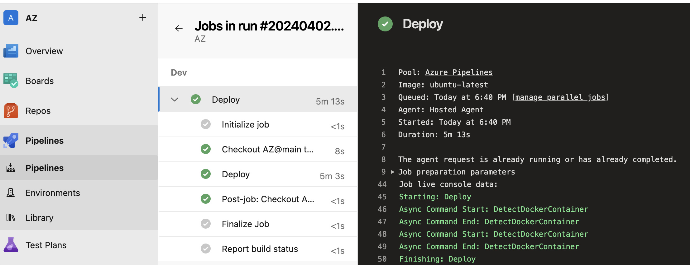

**<h1>Setup CI/CD pipelines using Azure pipelines</h1>**
**<h3>Objective:</h3>**
Objective is to set up CI/CD pipelines using Azure Pipelines for provisioning infrastructure across multiple environments (Dev, QA, Staging, and Prod) using Terraform. The infrastructure includes Virtual Machines (VMs), Key Vault, and Storage Accounts.

**<h3>FILES:</h3>**
**<h5>main.tf:</h5>** 
Defined the Azure resources (Resource Group, Virtual Network, Subnet, Network Interface, Virtual Machine, Key Vault, Storage Account) using Terraform.
**<h5>var.tf:</h5>** 
Defined variables used in the Terraform configuration of resource names, locations, sizes, etc.
**<h5>Env.tf:</h5>**
Defined Terraform modules for provisioning infrastructure across different environments.
**<h5>azure-pipeline.yml:</h5>** 
YAML file for setting up CI/CD pipelines for deploying infrastructure changes automatically.
**<h3>TERRAFORM CONFIGURATION:</h3>**
The Terraform configuration files (env.tf, main.tf, var.tf) outline the infrastructure resources needed for various environments. These resources include Virtual Machines, Virtual Networks, Subnets, Network Interfaces, Key Vaults, and Storage Accounts. You can adjust the variables in var.tf to suit your specific needs.

**<h3>CI/CD PIPELINE:</h3>**
The pipeline.yml file has the Azure Pipelines YAML setup for creating CI/CD pipelines. It sets up triggers for the main branch and outlines stages for deploying infrastructure updates to Dev, QA, staging, and Prod environments using Terraform.

**<h3>Getting Started:</h3>**
To start deploying infrastructure using Terraform and Azure Pipelines, first, ensure you have access to an Azure DevOps organization and have set up Azure service principals for authentication. Next, update the variables in the variables.tf file with the specific values you want for your environment. Then, configure the Azure Pipelines YAML file (pipeline.yml) with the necessary variables for authentication and environment-specific settings. Finally, commit and push your changes to the repository to trigger the CI/CD pipeline and begin the deployment process.
**<h3>DEPENDENCIES:</h3>**
We will need an Azure DevOps organization that allows to create and manage pipelines. Also, we need an Azure service principal with the necessary permissions for handling Azure resources. Install Terraform on the build agent so it can execute Terraform commands
**<h2>Results:</h2>**

